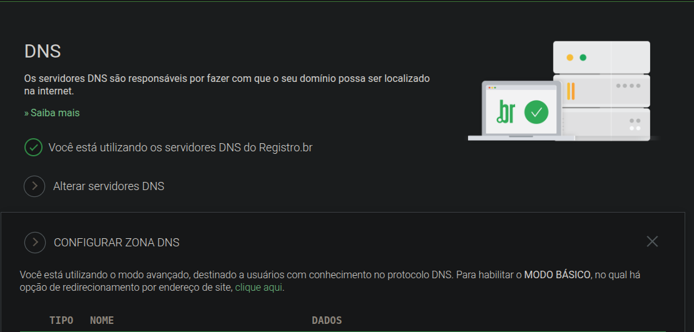

# Gerando um Certificado SSL Coringa grátis com WILDCARD

Este guia irá ensinar como configura o certificado SSL em uma aplicação NGINX

obs: O certificado coringa significa que o SSL estará ativo tanto para o domínio atual quanto para os subdomínios

## Passo a Passo

### 1 -  Acesse o Servidor a Ter o SSL Configurado

Você irá precisar ter um servidor para realizar este processo

Acesse o servidor usando `ssh YOUR_USER@YOUR_IP
`

### 2 - Instale as Dependências Necessárias

Para gerar a certificação SSL iremos precisar de alguns pacotes para nos auxiliar. Instale-os usando os comandos a baixo:

```bash
sudo apt update
sudo apt install certbot python3-certbot-nginx
```

### 3 - Execute o Comando para Gerar o Certificado SSH

Execute o comando a baixo, trocando `YOUR_DOMAIN_` pelo seu domínio domínio root da aplicação e `YOUR_DOMAIN` pelo domínio que ficará responsável por validar o SSL (**observação**: Você pode usar o mesmo domínio em ambos os casos)

```bash
sudo certbot certonly --manual --preferred-challenges dns -d "*.YOUR_DOMAIN_" -d "YOUR_DOMAIN"
```

### 4 - Confirmação de Identidade

Irá aparecer o seguinte comentário em seu terminal, caso o comando a cima funcione corretamente

```bash
Saving debug log to /var/log/letsencrypt/letsencrypt.log
Enter email address (used for urgent renewal and security notices)
 (Enter 'c' to cancel): 
```

Insira seu e-mail e pressione enter

### 5 - Aceite os Termos de Uso

Você irá visualizar a seguinte mensagem no terminal

```bash
Please read the Terms of Service at
https://letsencrypt.org/documents/LE-SA-v1.4-April-3-2024.pdf. You must agree in
order to register with the ACME server. Do you agree?
```

Basta confirmar os termos digitando `y` e pressionando enter

Todas as mensagens posteriores que pedirem confirmação, devem ser respondidas com `y`

### 6- Validação de Token para Gerar o SSL

Você irá se deparar com algo parecido com isso

```bash
Please deploy a DNS TXT record under the name:

_acme-challenge.YOUR_DOMAIN

with the following value:

YOUR_TOKEN
```

Copie seu token

### 6 - Registro.BR

Essa etapa pode demorar um pouco para funcionar

Siga o vídeo usando o painel a baixo do registro.br



### 7 - Acesse onde o NGINX tem seu Arquivos de Configurações

Procure o arquivo de configurações que tem a chave `server`

## Referências

[COMO INSTALAR UM CERTIFICADO SSL WILDCARD GRÁTIS COM NGINX E LET'S ENCRYPT | COFFOPS](https://www.youtube.com/watch?v=NUIh3zsRwAI)
